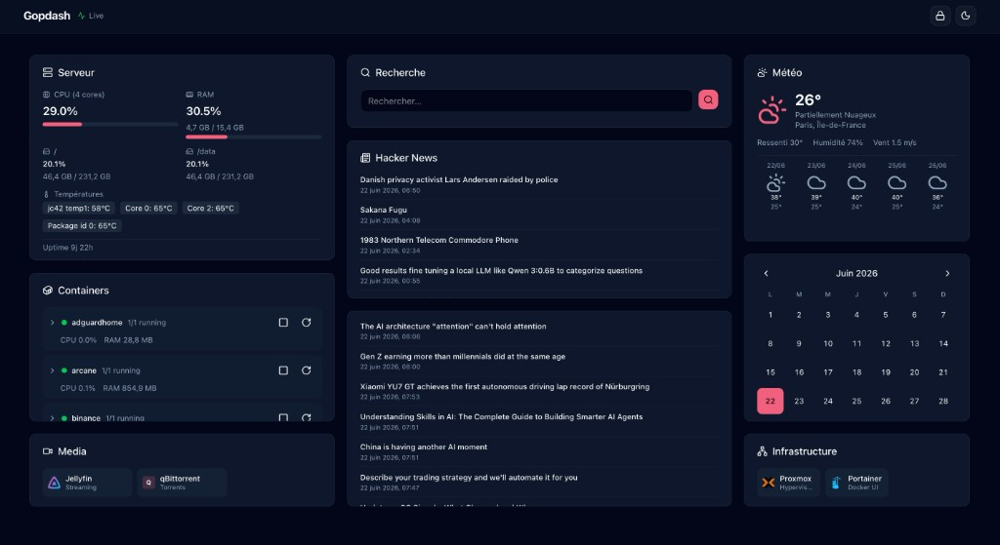
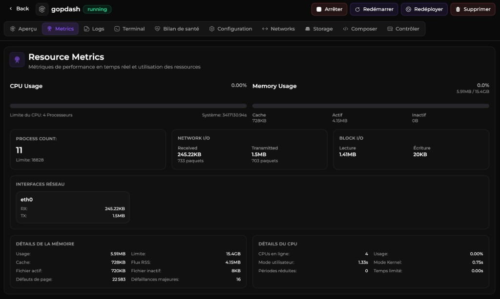

# Gopdash

[](LICENSE)

Dashboard self-hosted ultra-léger. Un seul container Docker, drag & drop de widgets, hot-reload de la configuration.



## Stack

| Couche | Technologie |
|--------|-------------|
| Backend | Rust + Axum + Tokio |
| Frontend | SvelteKit 5 (SPA statique) + TypeScript + Tailwind CSS |
| UI | Composants style shadcn-svelte + Bits UI + Lucide |
| Layout | Gridstack.js (drag & drop, resize) |
| Config | Dossier `config/` (YAML éclaté) avec hot-reload |
| Docker API | Bollard |
| Métriques système | sysinfo |
| Temps réel | Server-Sent Events (SSE) |

## Démarrage rapide

```bash
# 1. Initialiser (copie config.example/ vers config/ — dossier local, non versionné)
make init

# 2. Éditer la configuration (config/ est dans .gitignore : clés API, mots de passe, etc.)
# config/app.yaml        → titre, auth, thème, settings
# config/dashboard.yaml  → widgets affichés
# config/services.yaml   → weather, docker, bookmarks, rss, search_engines
# config/layout.yaml     → positions (géré auto si persist_layout)

# 3. Lancer en dev (backend :8080 + frontend :5173)
make dev

# 4. Ou en production Docker
make docker
```

Accès : **http://localhost:8080**

## Initialisation manuelle

```bash
# Backend
cargo new backend --name gopdash
cd backend
# Copier Cargo.toml et src/ depuis ce repo

# Frontend
npm create svelte@latest frontend   # ou: npx sv create frontend
cd frontend
npm install
npx shadcn-svelte@latest init       # composants UI additionnels

# Config
cp -r config.example config
```

## Structure

```
Gopdash/
├── backend/           # API Rust (Axum)
│   └── src/
│       ├── config.rs      # Parsing YAML + hot-reload
│       ├── routes/        # REST + SSE
│       ├── services/      # Docker, System, Weather, RSS
│       └── middleware/    # Auth session (cookie)
├── frontend/          # SPA SvelteKit
│   └── src/lib/
│       ├── components/    # Dashboard, widgets, UI
│       ├── stores/        # Config, SSE
│       └── api.ts         # Client API
├── config.example/    # Modèle de config (copié vers config/ par 'make init')
│   ├── app.yaml           # Titre, auth, thème, settings
│   ├── dashboard.yaml     # Widgets affichés
│   ├── services.yaml      # weather, docker, bookmarks, rss
│   └── layout.yaml        # Positions Gridstack (géré auto)
├── Dockerfile         # Multi-stage (Node + Rust + Debian slim)
├── docker-compose.yml
└── Makefile
```

## Widgets disponibles

| Widget | Description | Config YAML |
|--------|-------------|-------------|
| `system` | CPU, RAM, disques, températures | `type: system` |
| `docker` | Containers + actions start/stop/restart | `type: docker` |
| `docker-updates` | Mises à jour d'images Docker (pull + recréation + prune) | `type: docker-updates` |
| `docker-stack` | Contrôle groupé start/stop/restart de stacks | `type: docker-stack` + `stacks` |
| `weather` | OpenWeatherMap current + 5 jours | `type: weather` |
| `bookmarks` | Groupes de liens favoris (+ health check optionnel) | `type: bookmarks` + `columns` (défaut 3) |
| `rss` | Flux RSS récents | `type: rss` |
| `calendar` | Calendrier mensuel + horloge (locale / fuseau) | `type: calendar` + `show_today`, `show_outside_days`, `show_navigation` |
| `search` | Recherche web multi-moteurs | `type: search` + `engine`, `target` |
| `jellyfin` | Now Playing + compteurs bibliothèque | `type: jellyfin` + config dans `services.yaml` |

### Locale et fuseau horaire

Dans `config/app.yaml`, sous `settings` :

```yaml
settings:
  persist_layout: true
  locale: fr-FR          # BCP 47 — fr-FR, en-US…
  timezone: Europe/Paris # IANA — Europe/Paris, America/New_York…
```

Ces valeurs sont exposées via `/api/config` et utilisées par les widgets (dates, unités, libellés).

Les textes de l'interface sont dans `frontend/src/locales/` (`fr.json`, `en.json`). La langue active est déduite de `settings.locale` (ex. `fr-FR` → `fr.json`). Pour ajouter une langue, créez un fichier `{lang}.json` avec les mêmes clés et enregistrez-le dans `locale.ts`.

### Moteurs de recherche

Définis dans `config/services.yaml` — un widget `search` = un moteur (via `engine`) :

```yaml
search_engines:
  - id: google
    name: Google
    url: https://www.google.com/search?q={query}
    icon: sh:google
```

Dans `config/dashboard.yaml` (un widget par moteur souhaité) :

```yaml
- type: search
  id: search-google
  title: Google
  icon: sh:google
  engine: google      # id du moteur (services.yaml)
  target: new-tab     # new-tab | same-tab
```

### Health check sur les favoris

Sur chaque lien dans `config/services.yaml` → `bookmarks`, active la surveillance HTTP :

```yaml
bookmarks:
  - name: Media
    links:
      - name: Jellyfin
        url: https://jellyfin.local
        icon: sh:jellyfin
        health_check: true
      - name: Jackett
        url: http://192.168.1.200:9117/
        icon: sh:jackett
        health_check: true
        health_url: http://192.168.1.200:9117/UI/Login  # URL à sonder (défaut : url)
        expected_status: 302   # sinon 2xx = OK
        # insecure: true        # certificats auto-signés
```

Le widget `bookmarks` affiche une pastille verte/rouge et la latence. Rafraîchissement selon `refresh_interval` de `app.yaml`.

### Mises à jour Docker

Widget dédié pour vérifier si une nouvelle image est disponible et la déployer (pull + recréation du container) :

```yaml
- type: docker-updates
  id: docker-updates-1
  title: Mises à jour
  icon: lucide:arrow-up-circle
  containers:
    - jellyfin
    - radarr
  show_all: false   # true = tous les containers
```

Pastilles : orange = mise à jour dispo. Seuls les containers avec une mise à jour disponible sont listés (à jour ou statut inconnu = masqués).

Le widget propose aussi :
- **Actualiser** — revérifier les mises à jour
- **Prune** (icône poubelle) — supprime les images inutilisées (`docker image prune -a`), avec confirmation et résumé de l'espace libéré

### Stacks Docker (contrôle groupé)

Démarre, arrête ou redémarre plusieurs containers ou stacks Compose d'un coup :

```yaml
- type: docker-stack
  id: docker-stack-1
  title: Stacks
  icon: lucide:layers
  stacks:
    - name: Webserver
      targets: [webserver]     # nom du projet Compose
    - name: Mail
      targets: [mailpit]       # nom de container (filtre partiel)
```

Chaque ligne affiche **x/x actifs**, une pastille d'état et un tooltip listant les containers. Réutilise les API Docker existantes (start/stop/restart).

### Widget Jellyfin

Configuration serveur dans `config/services.yaml` (clé API : Jellyfin → Dashboard → API Keys) :

```yaml
jellyfin:
  url: https://jellyfin.local
  api_key: "your-api-key"
  # insecure: true   # certificats auto-signés
```

Widget dans `config/dashboard.yaml` :

```yaml
- type: jellyfin
  id: jellyfin-1
  title: Jellyfin
  icon: sh:jellyfin
  show_now_playing: true      # sessions en lecture (défaut : true)
  show_library_counts: true   # films / séries / épisodes (défaut : true)
  max_sessions: 3             # nombre max de lectures affichées
```

Le backend proxy les appels Jellyfin (`/Sessions`, `/Items/Counts`) et les posters. Rafraîchissement selon `refresh_interval` de `app.yaml`.

## API REST

| Endpoint | Méthode | Description |
|----------|---------|-------------|
| `/api/health` | GET | Healthcheck |
| `/api/config` | GET | Configuration publique |
| `/api/config/layout` | PUT | Sauvegarde layout dans `config/layout.yaml` |
| `/api/docker/containers` | GET | Liste containers |
| `/api/docker/containers/{id}/start` | POST | Démarrer |
| `/api/docker/containers/{id}/stop` | POST | Arrêter |
| `/api/docker/containers/{id}/restart` | POST | Redémarrer |
| `/api/docker/updates` | GET | Vérifier les mises à jour d'images |
| `/api/docker/containers/{id}/update` | POST | Pull + recréer le container |
| `/api/docker/images/prune` | POST | Supprimer les images inutilisées (`docker image prune -a`) |
| `/api/system` | GET | Métriques système |
| `/api/weather` | GET | Météo |
| `/api/bookmarks` | GET | Liens favoris |
| `/api/bookmarks/health` | GET | Statut des liens avec `health_check` (`?group=Media`) |
| `/api/rss/{feed}` | GET | Articles RSS |
| `/api/events` | GET (SSE) | Mises à jour temps réel |

## Ajouter un nouveau widget

### 1. Backend — `config.rs`

Ajouter une variante à l'enum `WidgetConfig` :

```rust
#[derive(Debug, Clone, Deserialize, Serialize)]
#[serde(tag = "type", rename_all = "kebab-case")]
pub enum WidgetConfig {
    // ...existing...
    MyWidget {
        id: String,
        title: Option<String>,
        x: i32, y: i32, w: i32, h: i32,
        // champs spécifiques
        custom_field: String,
    },
}
```

### 2. Backend — Service + route

Créer `backend/src/services/my_widget.rs` et ajouter une route dans `routes/api.rs`.

### 3. Frontend — Types

Ajouter le type dans `frontend/src/lib/types.ts` :

```typescript
export type WidgetType = 'docker' | 'system' | ... | 'my-widget';
// + champs optionnels dans WidgetConfig
```

### 4. Frontend — Composant

Créer `frontend/src/lib/components/widgets/MyWidget.svelte` et l'enregistrer dans `WidgetRenderer.svelte`.

### 5. Configuration

Dans `config/dashboard.yaml` :

```yaml
widgets:
  - type: my-widget
    id: my-widget-1
    title: Mon Widget
    custom_field: value
```

Les positions (`x`, `y`, `w`, `h`) sont dans `config/layout.yaml` (géré automatiquement si `persist_layout: true`).

## Sécurité Docker

- Le socket Docker est monté **en lecture seule** (`:ro`) dans docker-compose
- Les actions start/stop/restart passent par l'API Rust (pas d'accès direct depuis le navigateur)
- Auth optionnelle via page de connexion (`/login`) et session cookie — config dans `config/app.yaml`
- `no-new-privileges` activé sur le container

## Variables d'environnement

| Variable | Défaut | Description |
|----------|--------|-------------|
| `CONFIG_DIR` | `config` | Dossier de configuration (`app.yaml`, `dashboard.yaml`, `services.yaml`, `layout.yaml`) |
| `STATIC_DIR` | `./static` | Fichiers statiques SvelteKit |
| `HOST` | `0.0.0.0` | Adresse d'écoute |
| `PORT` | `8080` | Port HTTP |
| `RUST_LOG` | `gopdash=info` | Niveau de log |

Le backend charge `CONFIG_DIR` s'il existe. Sinon, il peut retomber sur un fichier unique via `CONFIG_PATH` (mode legacy, déconseillé).

## Build production

```bash
make build          # Frontend + backend release
make run            # Lance le binaire local
make docker         # Container Docker optimisé
```

Le Dockerfile produit une image ~50-80 MB (Debian slim + binaire Rust strip + assets statiques gzip).

À l'exécution, la consommation reste très faible (ex. ~6 Mo RAM, CPU quasi nul au repos) :



## Développement

```bash
make docker-stop    # libérer le port 8080 si le container tourne déjà
make dev-stop       # tuer un ancien gopdash local sur :8080
make dev-backend    # Rust seul (port 8080)
make dev-frontend   # Vite dev server (port 5173, proxy /api)
make check          # cargo check + svelte-check
make clean          # Nettoyage
```

En dev, ouvrez **http://localhost:5173** (le frontend proxyfie `/api` vers le backend).

Prérequis locaux :
- **Docker Desktop** démarré pour le widget Docker (socket auto-détecté sur macOS : `~/.docker/run/docker.sock`)
- `npm install` à la racine du repo (workspace npm, pas seulement dans `frontend/`)

## Librairies utilisées

### Backend (Rust)

| Librairie | Rôle |
|-----------|------|
| [Axum](https://github.com/tokio-rs/axum) | Framework HTTP / API REST |
| [Tokio](https://tokio.rs/) | Runtime async |
| [Tower HTTP](https://github.com/tower-rs/tower-http) | Middleware (fichiers statiques, compression, traces) |
| [Bollard](https://github.com/fussybeaver/bollard) | Client API Docker |
| [sysinfo](https://github.com/GuillaumeGomez/sysinfo) | Métriques système (CPU, RAM, disques) |
| [reqwest](https://github.com/seanmonstar/reqwest) | Client HTTP (météo, géocodage) |
| [rss](https://github.com/rust-syndication/rss-rs) | Parsing flux RSS |
| [serde](https://serde.rs/) / [serde_yaml](https://github.com/dtolnay/serde-yaml) | Sérialisation config YAML |
| [notify](https://github.com/notify-rs/notify) | Hot-reload de la configuration |
| [tracing](https://github.com/tokio-rs/tracing) | Logs structurés |
| [chrono](https://github.com/chronotope/chrono) | Dates et heures |

### Frontend (TypeScript / Svelte)

| Librairie | Rôle |
|-----------|------|
| [SvelteKit](https://kit.svelte.dev/) / [Svelte 5](https://svelte.dev/) | Framework UI (SPA statique) |
| [Vite](https://vite.dev/) | Bundler et dev server |
| [Tailwind CSS](https://tailwindcss.com/) | Styles utilitaires |
| [GridStack.js](https://gridstackjs.com/) | Grille drag & drop des widgets |
| [Bits UI](https://bits-ui.com/) | Composants headless (base shadcn-svelte) |
| [Lucide](https://lucide.dev/) | Icônes SVG |
| [mode-watcher](https://github.com/svecosystem/mode-watcher) | Gestion thème clair / sombre |
| [clsx](https://github.com/lukeed/clsx) / [tailwind-merge](https://github.com/dcastil/tailwind-merge) | Composition de classes CSS |

### Services et ressources externes

| Ressource | Usage |
|-----------|-------|
| [Open-Meteo](https://open-meteo.com/) | Données météo (sans clé API) |
| [selfh.st/icons](https://selfh.st/icons/) | Icônes d'applications self-hosted |
| [lucide-static](https://github.com/lucide-icons/lucide-static) (CDN) | Icônes Lucide configurables |

## Licence

MIT — voir [LICENSE](LICENSE).
